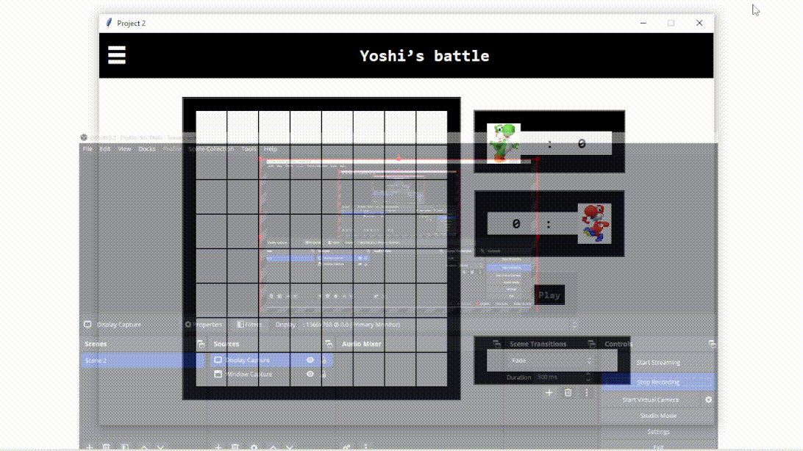

# Yoshi's battle AI Project

Welcome to the Yoshi's battle AI project repository! This repository contains the code related to the second project of the Artificial Intelligence course.

## Project Description

The objective of this project is to develop an AI system which consists of improving the machine's decision-making process by applying the minimax algorithm to a Yoshi's battle with alternating turns on a 8x8 grid.

### 👀 Take a look!

## Getting Started

To run the project, follow these steps:

1. Ensure you have Python installed on your machine
2. Clone this repository to your local machine.
3. Navigate to the project directory.
4. Run the main Python script to execute the AI system using the console command:\

`python gui.py `

5. The Tkinter GUI will be launched, allowing interaction with the AI system.

## Algorithms Implementation

1. Minimax Algorithm using breath first search [📄](proyecto/bfs.py)

## ⚠️Caution

Some improvements should be made. Those are listed below:

1. The performance of the minimax algorithm is suboptimal because the utility function needs improvement
2. The game mechanism for the machine's movement must be improved
3. Important improvements should be made to reuse code and improve the design of the application by using design patterns.
4. The user interface should be done using web technology.

**Note**: I will make these improvements progressively.

## Contributing

Contributions to this project are welcome! Feel free to fork the repository, make improvements, and submit pull requests.

## License

This project is licensed under the [MIT License](LICENSE).
